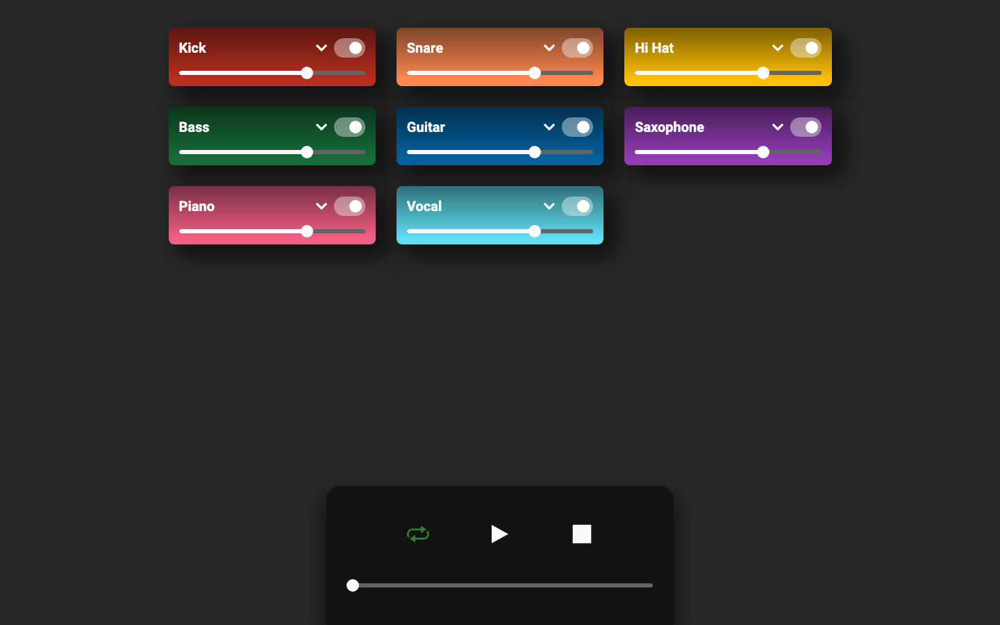
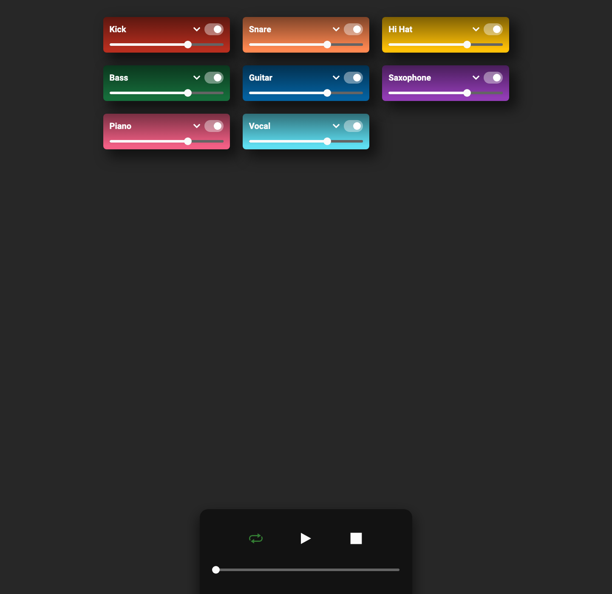
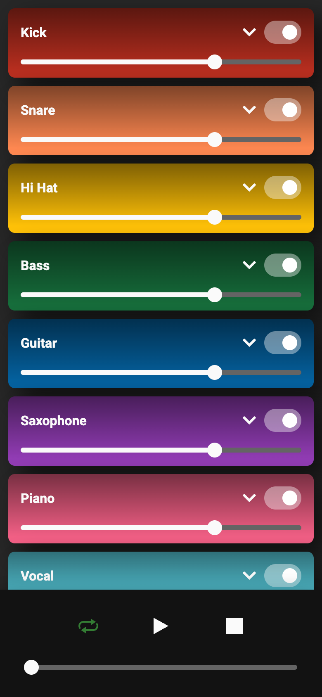

# Looper

A React music-looping application exploring audio playback, loop controls, and motion-driven UI interactions.

**Live site:** [onchetrit.github.io/looper](https://onchetrit.github.io/looper/)

## Tech

React, Redux, Framer Motion, Audioform, SCSS, and Create React App.

## Screenshots

| Desktop | App detail | Mobile |
| --- | --- | --- |
|  |  |  |

## Run locally

~~~bash
nvm use
npm install
npm start
~~~

Then open http://localhost:3000.

This project is pinned to Node 24.11.1 in `.nvmrc`. The CRA dependency tree
overrides its incompatible `memfs` release so the development server can run on
modern Node versions.

## Available scripts

~~~bash
npm start
npm test
npm run build
~~~
